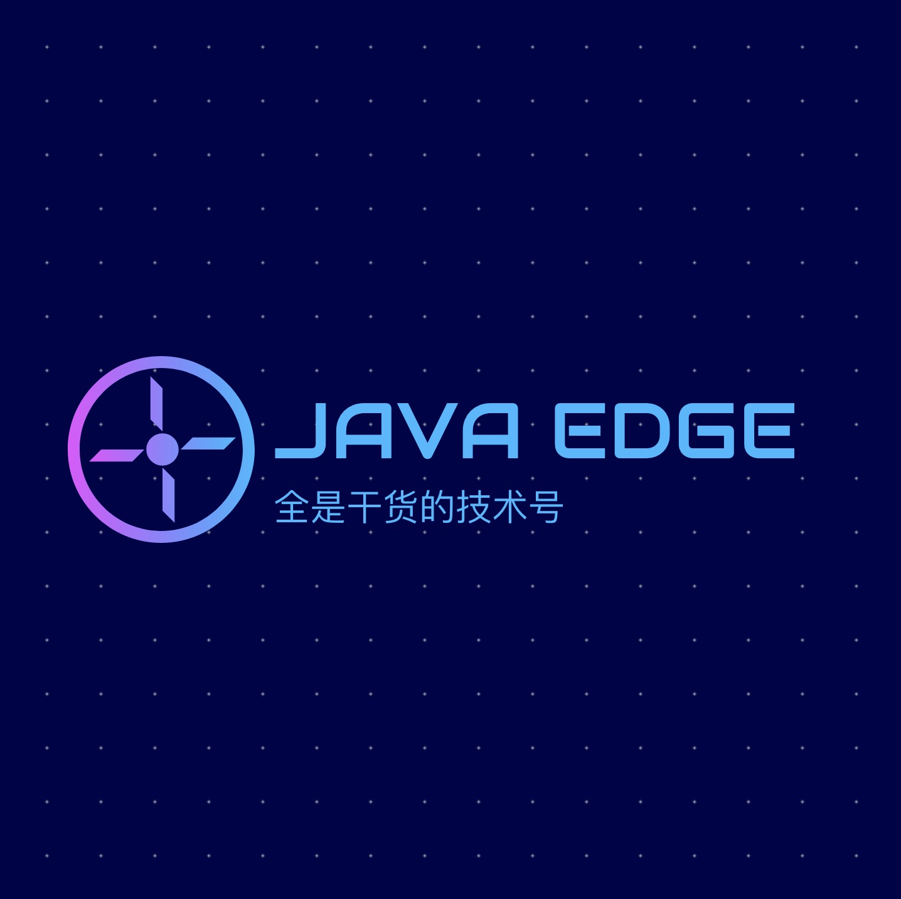

## 1 Java程序员充电、求职必备的核心知识库

全方位详细深入阐述高级Java程序员必备的软件设计技能。按照现有计划，主要研究如下方面知识点：

### 软件设计原则
1. 开闭原则
2. 依赖倒置原则
3. 单一职责原则
4. 接口隔离原则
5. 迪米特法则
6. 里氏替换原则
7. 合成复用原则

### 设计模式
1. 简单工厂
2. 工厂方法模式
3. 抽象工厂模式
4. 建造者模式
5. 单例模式
6. 原型模式
7. 外观模式
8. 装饰者模式
9. 适配器模式

## 2 公众号

更多精彩内容将发布在公众号 **JavaEdge**，公众号提供大量求职面试资料，后台回复 "面试" 即可领取。

本号系统整理了Java高级工程师必备技能点，帮你理清纷杂面试知识点，有的放矢。
我本人也是基于这些知识体系，在各种求职征途中拿到百度、携程、华为、中兴、顺丰、帆软、货拉拉等offer。

## 3 笔者简介

### [阿里云栖社区博客专家](https://yq.aliyun.com/users/article?spm=a2c4e.8091938.headeruserinfo.3.65993d6eqaQ0O6)

### [腾讯云自媒体邀约计划作者](https://cloud.tencent.com/developer/user/1752328)

    
     
    <a href="https://github.com/Wasabi1234/Java-Interview-Tutorial"> -read-4ab8a1.svg"></a>  
       

## 微信交流群

### 本人微信

## Java源码模拟面试解析指南

### 绘图工具

- [draw.io](https://www.draw.io/)
- keynote

